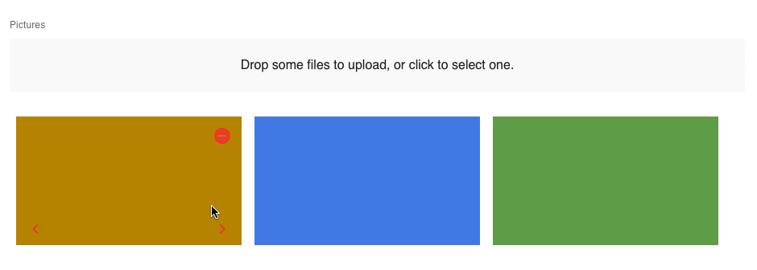

# react-admin-movable-image-input

react-admin의 ImageInput에서 이미지의 순서를 변경할 수 있는 기능이 추가된 Component 입니다.



## Installation

```
npm install @maugou/react-admin-movable-image-input
```

or

```
yarn add @maugou/react-admin-movable-image-input
```

<br>

## Usage

```js
import { MovableImageInput } from "@maugou/react-admin-movable-image-input";

<MovableImageInput source="pictures" label="Pictures" accept="image/*" multiple>
  <ImageField source="url" title="sequence" />
</MovableImageInput>;
```

### Properties

| Prop            | Required | Type                        | Default                          | Description                                                                                                                                                                                                                                                                  |
| --------------- | -------- | --------------------------- | -------------------------------- | ---------------------------------------------------------------------------------------------------------------------------------------------------------------------------------------------------------------------------------------------------------------------------- |
| `source`        | Required | `string`                    | -                                | Name of the entity property to use for the input value                                                                                                                                                                                                                       |
| `label`         | Optional | `string`                    | -                                | Input label. In i18n apps, the label is passed to the `translate` function. Defaults to the humanized `source` when omitted.                                                                                                                                                 |
| `validate`      | Optional | `Function` &#124; `array`   | -                                | Validation rules for the current property. See the [Validation Documentation](./CreateEdit.md#validation) for details.                                                                                                                                                       |
| `helperText`    | Optional | `string`                    | -                                | Text to be displayed under the input                                                                                                                                                                                                                                         |
| `fullWidth`     | Optional | `boolean`                   | false                            | If `true`, the input will expand to fill the form width                                                                                                                                                                                                                      |
| `className`     | Optional | `string`                    | -                                | Class name (usually generated by JSS) to customize the look and feel of the field element itself                                                                                                                                                                             |
| `formClassName` | Optional | `string`                    | -                                | Class name to be applied to the container of the input (e.g. the `<div>` forming each row in `<SimpleForm>`)                                                                                                                                                                 |
| `accept`        | Optional | `string` &#124; `string[]`  | -                                | Accepted file type(s), e. g. 'image/\*,.pdf'. If left empty, all file types are accepted. Equivalent of the `accept` attribute of an `<input type="file">`. See [here](https://developer.mozilla.org/en-US/docs/Web/HTML/Element/input/file#accept) for syntax and examples. |
| `children`      | Optional | `ReactNode`                 | -                                | Element used to display the preview of an image (cloned several times if the select accepts multiple files).                                                                                                                                                                 |
| `minSize`       | Optional | `number`                    | 0                                | Minimum image size (in bytes), e.g. 5000 form 5KB                                                                                                                                                                                                                            |
| `maxSize`       | Optional | `number`                    | Infinity                         | Maximum image size (in bytes), e.g. 5000000 for 5MB                                                                                                                                                                                                                          |
| `multiple`      | Optional | `boolean`                   | false                            | Set to true if the input should accept a list of images, false if it should only accept one image                                                                                                                                                                            |
| `labelSingle`   | Optional | `string`                    | 'ra.input.image. upload_single'  | Invite displayed in the drop zone if the input accepts one image                                                                                                                                                                                                             |
| `labelMultiple` | Optional | `string`                    | 'ra.input.file. upload_multiple' | Invite displayed in the drop zone if the input accepts several images                                                                                                                                                                                                        |
| `placeholder`   | Optional | `string` &#124; `ReactNode` | -                                | Invite displayed in the drop zone, overrides `labelSingle` and `labelMultiple`                                                                                                                                                                                               |
| `options`       | Optional | `Object`                    | {}                               | Additional options passed to react-dropzone's `useDropzone()` hook. See [the react-dropzone source](https://github.com/react-dropzone/react-dropzone/blob/master/src/index.js) for details .                                                                                 |
